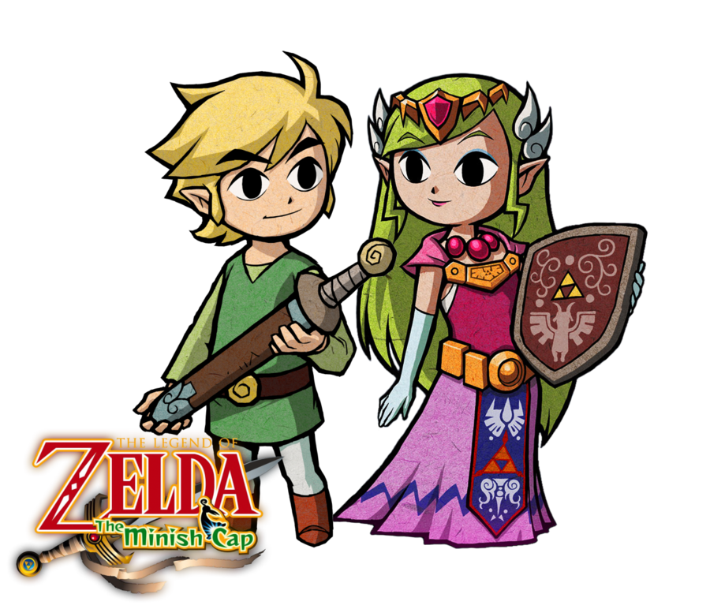

# zelda

Automatically `npm link` all your modules together!


Sometimes Link just needs a little help from Zelda.

### usage

1. Install it globally.

  ```bash
  npm install -g zelda
  ```

2. Run `zelda` from your project folder. Pass it a single argument -- the directory where all your code lives.

  ```bash
  zelda ~/code
  ```

`zelda` finds all the node packages in your code folder (`~/code/` in the example). If it finds any of these packages listed as a dependency in the nearest `package.json` of your current directory, it automatically symlinks it for you.

### what you might do if you're clever

1. Clone a cool project.

  ```bash
  cd ~/code
  git clone git@github.com:feross/webtorrent.git
  ```

2. Clone the project dependencies you plan to work on.

  ```bash
  git clone git@github.com:feross/bittorrent-protocol.git
  git clone git@github.com:feross/bittorrent-swarm.git
  git clone git@github.com:feross/bittorrent-dht.git
  ```

3. Recursively `npm install` all project dependencies, but `npm link` the ones that are local.

  ```bash
  cd webtorrent
  zelda ~/code
  ```

Gone are the days of running tons of `npm link` commands by hand!

### features

- Automatically `npm link` all your modules together
- Supports `dependencies`, `devDependencies`, and `optionalDependencies`
- Recursively runs `npm install` so your freshly cloned projects are ready to go!

### link is better with zelda!



## License

MIT. Copyright [Feross Aboukhadijeh](https://www.twitter.com/feross).
